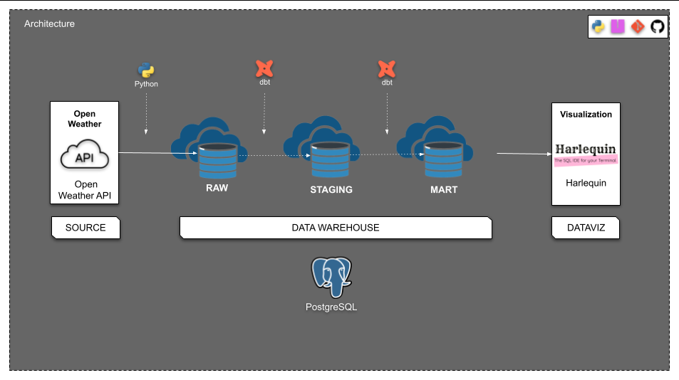

# DBT Weather API Project

A data pipeline project that extracts weather data from the OpenWeather API and transforms it using dbt (data build tool) with PostgreSQL as the data warehouse.

## Project Structure

This project consists of two main components:
- **Data Pipeline**: Python scripts for extracting weather data from OpenWeather API
- **dbt Transformations**: Data modeling and transformation using dbt



## Prerequisites

- Python 3.12+
- PostgreSQL database
- OpenWeather API key

## Setup

### 1. Environment Setup

Install dependencies using uv (recommended) or pip:

```bash
# Using uv
uv sync

# Or using pip
pip install -r requirements.txt
```

### 2. Database Configuration

Set up your PostgreSQL database and update the connection details in [`weather/scripts/.env`](weather/scripts/.env):

```env
OPENWEATHER_API_KEY=your_api_key_here
POSTGRES_DB=postgres
POSTGRES_USER=postgres
POSTGRES_PASSWORD=postgres
POSTGRES_HOST=localhost
POSTGRES_PORT=5432
```

### 3. dbt Configuration

The dbt project is configured in [`weather/dbt_project.yml`](weather/dbt_project.yml) with:
- **Staging models**: Materialized as views in the `staging` schema
- **Marts models**: Materialized as incremental tables in the `marts` schema

## Usage

### Running the Data Pipeline

1. Extract weather data using the Python pipeline:
```bash
cd weather/scripts
uv run data_pipeline.py
```

### Running dbt Transformations

Navigate to the weather directory and run dbt commands:

```bash
cd weather

# Install dbt packages
dbt deps

# Run all models
dbt run

# Run tests
dbt test

# Generate and serve documentation
dbt docs generate
dbt docs serve
```

## Project Components

### Data Pipeline ([`weather/scripts/`](weather/scripts/))
- Extracts weather data from OpenWeather API
- Loads raw data into PostgreSQL

### dbt Models ([`weather/models/`](weather/models/))
- **Sources**: Raw data source definitions
- **Staging**: Data cleaning and initial transformations
- **Marts**: Business logic and final data models

### Macros ([`weather/macros/`](weather/macros/))
- [`convert_to_local.sql`](weather/macros/convert_to_local.sql): Custom macro for timezone conversion
- [`get_custom_schema.sql`](weather/macros/get_custom_schema.sql): Custom schema naming logic

## Development

### Adding New Models

1. Create new model files in the appropriate subdirectory of [`weather/models/`](weather/models/)
2. Add tests in [`weather/tests/`](weather/tests/) or inline in model files
3. Run `dbt run` and `dbt test` to validate

### Project Commands

```bash
# Clean generated files
dbt clean

# Compile models without running
dbt compile

# Check for schema changes
dbt run-operation check_for_schema_changes
```

## Resources

- [dbt Documentation](https://docs.getdbt.com/)
- [OpenWeather API Documentation](https://openweathermap.org/api)
- [PostgreSQL Documentation](https://www.postgresql.org/docs/)

## License

This project is licensed under the MIT License.